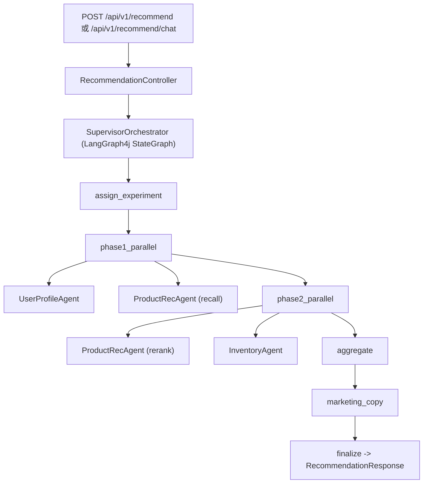

# Multi-Agent E-Commerce Recommendation System

> LangGraph4j + Spring Boot 的多 Agent 电商推荐系统（支持会话记忆、猜你想买、A/B 实验、营销文案、前端可视化）。

[](./java)
[](./java/pom.xml)
[](./java/pom.xml)

## 项目说明

> 当前版本已完整实现多 Agent 协同框架，包括用户画像、推荐召回/重排、库存决策、营销文案和实验编排。为保证本地可运行，部分 Agent 的内部能力采用规则逻辑、内置数据和 fallback 机制进行简化，但各 Agent 的职责边界、状态传递和编排流程均已真实落地。

这个项目不是“单体推荐函数”，而是一个可运行的 Supervisor 架构：

- `SupervisorOrchestrator`（LangGraph4j）负责流程编排
- `UserProfileAgent` 负责用户画像
- `ProductRecAgent` 负责召回 + 重排（含 LLM 可选路径）
- `InventoryAgent` 负责库存过滤和限购策略
- `MarketingCopyAgent` 负责生成营销文案
- `ABTestService` 负责实验分桶与策略路由

## 功能总览（表格版）

| 模块 | 当前实现 | 说明 |
|---|---|---|
| 用户画像 Agent | 已实现 | `UserFeatureStoreService` + 画像聚合，输出偏好类目、价格区间等 |
| 召回 Agent | 已实现 | 从 `product_catalog` 召回候选商品，支持策略参数 |
| 重排 Agent | 已实现 | 先规则/特征打分，再尝试 LLM 重排，失败自动 fallback |
| 库存 Agent | 已实现 | 读取 `inventory`，过滤缺货并输出限购与低库存提醒 |
| 文案 Agent | 已实现 | 按商品生成营销文案，支持 LLM 失败降级 |
| A/B 实验 | 已实现 | `control / treatment_llm / explore` 分桶与策略快照 |
| 会话记忆 | 已实现 | `sessionId` 驱动，支持“再来便宜点/换一批”这类差分推荐 |
| 猜你想买 | 已实现 | 入口与每轮对话后调用 `/recommend/guess-you-like` |
| 前端多会话 | 已实现 | 新建会话、会话切换、刷新后历史恢复（浏览器 `localStorage`） |

## 架构流程



StateGraph 节点定义位于：`java/src/main/java/com/ecommerce/orchestrator/SupervisorOrchestrator.java`。

## 目录结构

```text
multi-agent-ecommerce-system/
├── java/
│   ├── db/
│   │   └── init_schema_and_demo.sql
│   ├── init-db.ps1 / init-db.bat
│   ├── start.ps1
│   ├── pom.xml
│   └── src/main/
│       ├── java/com/ecommerce/
│       │   ├── agent/
│       │   ├── orchestrator/
│       │   ├── service/
│       │   ├── repository/
│       │   ├── entity/
│       │   └── config/
│       └── resources/
│           ├── application.yml
│           ├── application-ide.yml
│           ├── application-llm.yml
│           └── static/
└── README.md
```

## 接口清单

| 方法 | 路径 | 说明 |
|---|---|---|
| `POST` | `/api/v1/recommend` | 结构化推荐请求 |
| `POST` | `/api/v1/recommend/chat` | 自然语言推荐（支持 `sessionId`、会话记忆） |
| `GET` | `/api/v1/recommend/guess-you-like` | 猜你想买 |
| `GET` | `/api/v1/llm/status` | LLM 配置检查 |
| `GET` | `/api/v1/llm/smoke` | LLM 连通性冒烟测试 |
| `GET` | `/api/v1/experiments` | 实验快照 |
| `POST` | `/api/v1/experiments/track` | 实验结果回传 |
| `GET` | `/api/v1/health` | 健康检查 |

### 示例：聊天推荐

```http
POST /api/v1/recommend/chat
Content-Type: application/json
```

```json
{
  "userId": "u001",
  "sessionId": "sess-u001-xxxx",
  "query": "预算 3000，推荐性价比手机，不要苹果",
  "numItems": 5
}
```

返回中会包含：

- `sessionId`
- `products`
- `marketingCopies`
- `agentResults`
- `sessionMemory`（本轮应用的记忆提示）

## 快速开始（Windows）

### 1) 环境准备

| 组件 | 建议版本 |
|---|---|
| JDK | 17 或 21（运行期） |
| Maven | 3.9+ |
| PostgreSQL | 14+（已在 18 验证） |

### 2) 初始化数据库（表 + 演示数据）

```powershell
cd D:\xiangmu\multi-agent-ecommerce-system\java
.\init-db.ps1 -AdminUser postgres -AdminPassword root -AppDb postgres
```

脚本会自动：

1. 检查 `psql` 可用性
2. 创建数据库（若不存在）
3. 执行 `db/init_schema_and_demo.sql`
4. 打印 `product_catalog / inventory / recommendation_event` 行数

### 3) 启动后端

方式 A：推荐（自动检查 Java 与 PostgreSQL）

```powershell
cd D:\xiangmu\multi-agent-ecommerce-system\java
.\start.ps1
```

方式 B：Maven 启动

```powershell
cd D:\xiangmu\multi-agent-ecommerce-system\java
mvn --% spring-boot:run -Dmaven.compiler.release=17 -Dmaven.compiler.source=17 -Dmaven.compiler.target=17
```

## IDE 一键运行

`Main class`: `com.ecommerce.MultiAgentApplication`  
`Active profiles`: （已默认连接 PostgreSQL）

如果“点运行后立即退出”，优先检查：

1. 运行配置选的 JRE 是否有效（不要是 `D:/` 这种无效路径）
2. `application.yml` 的数据库配置是否可连
3. 8080 端口是否被占用

## 前端页面入口

| 地址 | 用途 |
|---|---|
| `http://localhost:8080/chat-ui.html` | 主聊天导购页（多会话 + 历史恢复 + 猜你想买） |
| `http://localhost:8080/style-ui-pro.html` | 风格化商品卡片页（默认先展示 3 个，点击“查看更多”到 6 个） |
| `http://localhost:8080/` | 默认转发到 `chat-ui.html` |

## 接入千问（Qwen）

项目使用 OpenAI 兼容协议接入。建议通过环境变量覆盖配置：

```powershell
$env:ECOM_LLM_BASE_URL="https://dashscope.aliyuncs.com/compatible-mode/v1"
$env:ECOM_LLM_MODEL="qwen-plus"
$env:SPRING_AI_OPENAI_API_KEY="your-real-key"
```

然后以 `llm` profile 启动，调用：

```powershell
Invoke-RestMethod "http://localhost:8080/api/v1/llm/status"
Invoke-RestMethod "http://localhost:8080/api/v1/llm/smoke?prompt=Reply%20PONG"
```

## 集成测试

```powershell
cd D:\xiangmu\multi-agent-ecommerce-system\java
mvn -q -Dtest=RecommendationControllerIntegrationTest test
```

