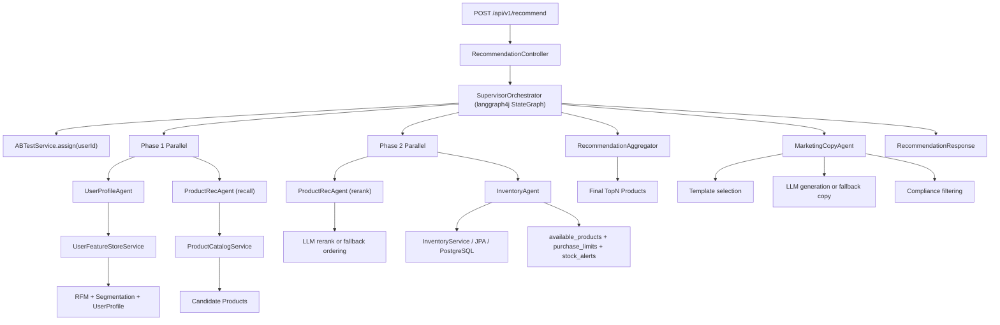

# Multi-Agent E-Commerce Recommendation System

> A runnable multi-agent demo for e-commerce recommendation, inventory decisioning, marketing copy generation, and online experimentation.

[](./java)


## What This Project Is

This repository demonstrates how to build a **LangGraph4j-powered Supervisor Multi-Agent system** for an e-commerce recommendation scenario.

Instead of putting all business logic into one service, the project splits recommendation into several specialist agents:

- `UserProfileAgent`: builds a structured user profile from behavior features
- `ProductRecAgent`: performs candidate recall and optional LLM reranking
- `InventoryAgent`: filters unavailable items and produces stock-related constraints
- `MarketingCopyAgent`: generates personalized copy for recommended products
- `SupervisorOrchestrator`: coordinates all agents through a `langgraph4j` state graph and aggregates their outputs

Current version statement:
The current version already implements the full multi-agent collaboration framework, including user profiling, recommendation recall/rerank, inventory decisioning, marketing copy generation, and experiment orchestration. To keep the project runnable in a local environment, some internal agent capabilities are simplified with rule-based logic, built-in data, and fallback mechanisms, but the agent boundaries, state handoff, and orchestration flow are all concretely implemented in code.

## Core Highlights

- Multi-agent architecture using `langgraph4j` + `Supervisor` orchestration pattern
- Parallel execution for user profiling, recall, rerank, and inventory validation
- Agent-level short-term and long-term memory modeling
- Thompson Sampling based A/B experimentation skeleton
- Inventory-aware recommendation aggregation
- LLM-ready reranking and marketing generation with graceful fallback
- Spring Boot backend plus a lightweight visualization dashboard

## Agent-Centric Design

### Supervisor + Specialist Agents

The system follows a `Supervisor` pattern implemented with `langgraph4j StateGraph`, instead of handoff-style agent chaining.
The orchestrator keeps control over task routing, phase boundaries, intermediate state, and final aggregation.

This makes the pipeline easier to:

- observe
- test
- extend
- run in parallel
- experiment on at the agent level

### Memory Design

The project already reflects a useful agent-memory split:

- **Working memory**:
  request context, recalled candidates, reranked results, stock decisions, and final aggregation state maintained by the Supervisor during one request
- **Long-term memory**:
  user behavior features, RFM scores, preferred categories, price range, and user segments represented by `UserProfile`

This allows downstream agents to consume the outputs of upstream agents rather than acting in isolation.

### Collaboration Flow

- `UserProfileAgent` produces structured preferences and user segments
- `ProductRecAgent` uses that context to drive recall and rerank
- `InventoryAgent` constrains recommendation results with stock signals
- `MarketingCopyAgent` uses user segment + product set to generate final personalized output

## Architecture



## Repository Layout

```text
multi-agent-ecommerce-system/
├── java/                         # Main Spring Boot implementation
│   ├── src/main/java/com/ecommerce/
│   │   ├── agent/               # Specialist agents
│   │   ├── config/              # Spring config and bootstrap
│   │   ├── entity/              # JPA entities
│   │   ├── model/               # Request/response/domain models
│   │   ├── orchestrator/        # LangGraph4j-based Supervisor orchestration
│   │   ├── repository/          # Repositories
│   │   └── service/             # Feature store, inventory, aggregation, A/B test
│   └── src/main/resources/static/
│       ├── index.html           # Visualization dashboard
│       ├── styles.css
│       └── app.js
├── python/                       # Python version
├── go/                           # Go version
└── docs/                         # Architecture notes and supporting docs
```


## API Example

### Request

```http
POST /api/v1/recommend
Content-Type: application/json
```

```json
{
  "userId": "u001",
  "scene": "homepage",
  "numItems": 3,
  "context": {
    "scene": "homepage"
  }
}
```

### Response Shape

```json
{
  "requestId": "xxx",
  "userId": "u001",
  "products": [],
  "marketingCopies": [],
  "experimentGroup": "control",
  "experimentInfo": {},
  "purchaseLimits": {},
  "lowStockAlerts": [],
  "agentResults": {},
  "totalLatencyMs": 123.4,
  "timestamp": "2026-04-12T12:30:01Z"
}
```

## Testing

Run the Java integration test:

```powershell
cd D:\xiangmu\multi-agent-ecommerce-system\java
mvn -q -Dtest=RecommendationControllerIntegrationTest test
```

## PostgreSQL Setup

The application now uses PostgreSQL by default.

```powershell
$env:DB_HOST="localhost"
$env:DB_PORT="5432"
$env:DB_NAME="ecommerce"
$env:DB_USER="postgres"
$env:DB_PASSWORD="postgres"
```

Start the backend:

```powershell
cd D:\xiangmu\multi-agent-ecommerce-system\java
mvn --% spring-boot:run -Dmaven.compiler.release= -Dmaven.compiler.source=17 -Dmaven.compiler.target=17
```

Or use the startup script (checks PostgreSQL connectivity and fixes Windows `java.home=D:` issue):

```powershell
cd D:\xiangmu\multi-agent-ecommerce-system\java
.\start.ps1
```

## IDE One-Click Run

If you want to run directly from IDE without preparing PostgreSQL first, use profile `ide`:

1. Open run configuration for `com.ecommerce.MultiAgentApplication`
2. Set Active profiles: `ide`
3. Click the green Run button

This profile uses in-memory H2 (`MODE=PostgreSQL`) for local one-click startup.

## LLM Integration Test

The Java service now includes two LLM verification endpoints:

- `GET /api/v1/llm/status`: show current model/base-url/api-key status
- `GET /api/v1/llm/smoke`: send a real prompt to the configured LLM

### 1. Set environment variables (PowerShell)

```powershell
$env:DASHSCOPE_API_KEY="sk-xxxxx"
$env:ECOM_LLM_BASE_URL="https://dashscope.aliyuncs.com/compatible-mode/v1"
$env:ECOM_LLM_MODEL="qwen-plus"
```

If you use another OpenAI-compatible provider, only keep `api-key`/`base-url`/`model` aligned with that provider.

### 2. Start with `llm` profile

```powershell
cd D:\xiangmu\multi-agent-ecommerce-system\java
mvn --% spring-boot:run -Dspring-boot.run.profiles=llm -Dmaven.compiler.release= -Dmaven.compiler.source=17 -Dmaven.compiler.target=17
```

### 3. Verify model connectivity

```powershell
Invoke-RestMethod "http://localhost:8080/api/v1/llm/status"
Invoke-RestMethod "http://localhost:8080/api/v1/llm/smoke?prompt=Reply%20exactly%3A%20PONG"
```

### 4. Run recommendation request (with real LLM path)

```powershell
$body = @{
  userId = "u001"
  scene = "homepage"
  numItems = 3
  context = @{ scene = "homepage" }
} | ConvertTo-Json -Depth 5

Invoke-RestMethod "http://localhost:8080/api/v1/recommend" `
  -Method POST `
  -ContentType "application/json" `
  -Body $body
```


## Notes for Open Source Users

- This is not a full production recommendation platform
- It is a well-structured demo intended for learning, experimentation, and portfolio use
- If you want real LLM behavior, provide valid model credentials and endpoint config
- If you want real online data dependencies, wire Redis/PostgreSQL to the existing service boundaries

## Acknowledgements

This project is inspired by common production patterns in:

- recommendation systems
- multi-agent orchestration
- experimentation platforms
- inventory-aware ranking
- LLM-assisted decision systems

## Star History

If this project helps you, feel free to star it and adapt it for your own learning or portfolio.
